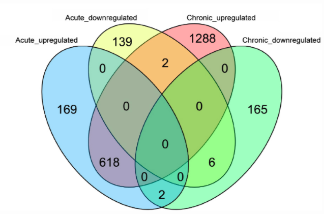

REMEMBER TO COMMENT AS YOU GO!!!!!!!!
SETWD WITH GUI


```{r setup, message=FALSE, warning=F}
library(AnnotationHub)
library(AnnotationDbi)
library(DESeq2)
library(tidyverse)
```

Before starting this section, we will make sure we have all the relevant objects
from the Differential Expression analysis.

```{r loadData}
ddsObj.interaction <- readRDS("RObjects/DESeqDataSet.interaction.rds")
results.interaction.11 <- readRDS("RObjects/DESeqResults.interaction_d11.rds")
results.interaction.33 <- readRDS("RObjects/DESeqResults.interaction_d33.rds")
```

# Overview

- Getting annotation
- Visualising DE results

# Adding annotation to the DESeq2 results

VIEW results

only see the Ensembl Gene ID, which is not very informative. 

There are a number of ways to add annotation. 

Bioconductor annotation 
re-built somewhat periodically 

An alternative approach is to use `biomaRt`, ensures latest annotations 

Or use best of both worlds, online (much more frequently updated) annotationhub that caches on machine so fast.

Today we will use the annotation package method. 

A workflow for annotation with biomaRt is included in the extended materials section acessible on the course website.

## Query the database

First we need to get the correct database from `AnnotationHub`. We make the instance (the first time we do this it will create a local cache on your machine so that repeat queries are very quick). 

As you can see `ah` contains huge amounts of information and it is constantly changing. This is why it gives us the snapshot date so we know when our cached version is from. The `ah` object actually online contains pointers to where all the information is online and we don't want to download all of them as it would take a very long time and we don't need all of it.

This object is a vector and you can get information about a single resource by indexing with a single bracket `[` or download a resource with a double bracket `[[`.

```{r, makeOrgDb, message=F}

# create an annotationhub instance
ah <- AnnotationHub()
ah

ah[1]

# Download the database we want to use
OrgDb <- query(ah, c("OrgDb", "Mus musculus"))[[1]]

```

We use the select function to query the database. 

Now we need to set up a query.

This requires us to tell it what we want and what we have. For this we need to 
specify three things: 

(a) What type of information we are going to search the dataset on - called
**keytypes**. In our case this is Ensembl Gene IDs
(b) A vector of the **keys** for our filter - the Ensembl Gene IDs from our DE 
results table
(c) What columns (**columns**) of the dataset we want returned.


```{r queryOrgDb, message=F}
# what can we search for? 'columns'
columns(OrgDb)

# what can we search with? 'keytypes'
keytypes(OrgDb)

# lets set it up
ourCols <- c("SYMBOL", "ENSEMBL", "ENTREZID")
ourKeys <- rownames(results.interaction.11)[1:1000]

# run the query
annot <- AnnotationDbi::select(OrgDb, 
                keys=ourKeys, 
                columns=ourCols, 
                keytype="ENSEMBL")
```


### One-to-many relationships

Let's inspect the annotation.

```{r inspectAnnot}
head(annot)
length(unique(annot$ENTREZID))
sum(is.na(annot$ENTREZID)) # Why are there NAs in the ENTREZID column?

dim(annot) # why are there more than 1000 rows?

# find all rows containing duplicated ensembl ids
annot %>%  
    add_count(ENSEMBL) %>%  
    dplyr::filter(n>1)
```

There is one Ensembl ID with no EntrezID. 

This gene id had no Entrez ID in the `OrgDb` database.

Ensembl and Entrez databases don't match on a 1:1 level 

There are some genes that have multiple entries 

This is because there are multiple Entrez IDs for a single Ensembl 
gene. 

These one-to-many relationships come up frequently in genomic databases, 
it is important to be aware of them and check when necessary. 

this illustrates how/why annotation is complicated and difficult

## Exercise 1 - Retrieve the full annotation

> So far we have retrieved the annotation for just 1000 genes, but we need 
> annotations for the entire results table.
>
> A reminder of the code we have used so far:

```{r eval=FALSE}
# lets set it up
ourCols <- c("ENSEMBL", "SYMBOL", "ENTREZID")
ourKeys <- rownames(results.interaction.11)[1:1000]

# run the query
annot <- AnnotationDbi::select(OrgDb, 
                keys=ourKeys, 
                columns=ourCols, 
                keytype="ENSEMBL")
```

> (a) Run the same query using all of the genes in our results table (`results.interaction.33`),
> and this time include the descriptive name of the genes too. Hint: You can find the 
> name of the column for this by running `columns(OrgDB)`
>
> (b) How many Ensembl genes have multipe Entrez IDs associated with them?
>
> (c) Are all of the Ensembl gene IDs annotated? If not, why do you think this 
> is?

```{r solutionChallenge1, eval=FALSE}
# (a)
ourKeys <- rownames(results.interaction.11)

# (b)
ourCols <- c("SYMBOL", "ENSEMBL", "ENTREZID", "GENENAME")

# run the query
annot <- AnnotationDbi::select(OrgDb, 
                keys=ourKeys, 
                columns=ourCols,
                keytype="ENSEMBL")

# (c)
annot %>%  
    add_count(ENSEMBL) %>%  
    dplyr::filter(n>1) %>% 
    distinct(ENSEMBL) %>%
    count()

# (d)
length(unique(annot$ENSEMBL))
length(ourKeys)
```

In this case the problems with the annotation aren't due to the versions as our snapshot was made 27-10-2020 which is the same date as version 102 (we used version 102 for counting reads in Day 1) was released. It is good to keep an eye on these things so you don't miss releases.

The is another set of databases within `AnnotationHub` which you can call instead called `EnsDb` and for these you can specify which release you prefer if so some reason you were not using the latest version.

## A curated annotation - one we prepared earlier

* we have created an annotation table:
    * modified the column names
    * added median transcript length
    * dealt with the one-to-many issues for Entrez IDs.

The code we used for doing this is available in the extended materials section.

```{r addAnnotation, message=FALSE}
ensemblAnnot <- readRDS("RObjects/Ensembl_annotations.rds")
colnames(ensemblAnnot)
annot.interaction.11 <- as.data.frame(results.interaction.11) %>% 
    rownames_to_column("GeneID") %>% 
    left_join(ensemblAnnot, "GeneID") %>% 
    rename(logFC=log2FoldChange, FDR=padj)
```

Finally we can output the annotation DE results using `write_tsv`.

```{r outputDEtables, eval=F}
write_tsv(annot.interaction.11, "results/Interaction.11_Results_Annotated.txt")
```

# Visualisation

## P-value histogram

A quick and easy "sanity check" for our DE results is to generate a p-value 
histogram. Dom's lecture.

Menti quiz

```{r pvalHist, fig.align="center"}
hist(annot.interaction.11$pvalue)
```

What we should see is a high bar in the `0 - 0.05` and then a roughly uniform tail to the right of this.

## Shrinking the log2FoldChange

Standard is to shrink lfc values for visualisation. 

High variance in lfc when expression is low. 

Meaning genes with low counts can look more significant that they are.

DESeq2 has lfcShrink function to shrink lfc estimates towards zero.

```{r shrinkLFC}
ddsShrink.11 <- lfcShrink(ddsObj.interaction, 
                       res = results.interaction.11,
                       type = "ashr")

shrinkTab.11 <- as.data.frame(ddsShrink.11) %>%
    rownames_to_column("GeneID") %>% 
    left_join(ensemblAnnot, "GeneID") %>% 
    rename(logFC=log2FoldChange, FDR=padj)
```

## MA plots

MA plots are a common way to visualize the results of a differential analysis. 

This plot shows the log-Fold Change for each 
gene against its average expression across all samples in the two conditions
being contrasted.  

`DESeq2` has a handy function for plotting this. 

Let's use it too compare the 
shrunk and un-shrunk fold changes.

```{r maPlotDESeq2, fig.align="center", fig.width=10, fig.height=5}

plotMA(results.interaction.11, alpha=0.05)

plotMA(ddsShrink.11, alpha=0.05)

```

The DESeq2 in `plotMA` function is fine for a quick look, but these inbuilt functions aren't easy to customise, make changes to the way it looks or add things such as gene labels. 

For this we would recommend using the ggplot package.

Another common visualisation is the 
[*volcano plot*](https://en.wikipedia.org/wiki/Volcano_plot_(statistics)) which 
displays a measure of significance on the y-axis and fold-change on the x-axis. We will use ggplot to create this.

### A Brief Introduction to `ggplot2`

The [`ggplot2`](http://ggplot2.tidyverse.org/) package has emerged as an 
attractive alternative to the traditional plots provided by base R. A full 
overview of all capabilities of the package is available from the 
[cheatsheet](https://www.rstudio.com/wp-content/uploads/2015/03/ggplot2-cheatsheet.pdf).

In brief:-

- `shrinkTab.11` is our data frame containing the variables we wish to plot
- `aes` creates a mapping between the variables in our data frame to the 
**_aes_**thetic properties of the plot:
    + the x-axis will be mapped to `logFC`
    + the y-axis will be mapped to the `-log10(pvalue)`
- `geom_point` specifies the particular type of plot we want (in this case a scatter 
plot)
- `geom_text` allows us to add labels to some or all of the points
    + see 
    [the cheatsheet](https://www.rstudio.com/wp-content/uploads/2015/03/ggplot2-cheatsheet.pdf) 
    for other plot types

The real advantage of `ggplot2` is the ability to change the appearance of our 
plot by mapping other variables to aspects of the plot. 

For the volcano plot we will colour according whether the gene has a pvalue below 0.05. 

We use a `-log10` transformation for the y-axis; it's commonly used for p-values as it means that more significant genes have a higher scale.


```{r volcano11Plot, fig.align="center", fig.width=5, fig.height=5}
volcanoTab.11 <- shrinkTab.11 %>% 
    mutate(`-log10(pvalue)` = -log10(pvalue))

ggplot(volcanoTab.11, aes(x = logFC, y=`-log10(pvalue)`)) + 
    geom_point(aes(colour=pvalue < 0.05), size=1) +
    geom_text(data=~top_n(.x, 1, wt=-FDR), aes(label=Symbol))
```

## Exercise 2 - Volcano plot for 33 days

Now it's your turn! We just made the volcano plot for the 11 days contrast, you will make the one for the 33 days contrast.

If you haven't already make sure you load in our data and annotation. You can copy and paste the code below.

```{r eval=FALSE}
# First load data and annotations
results.interaction.33 <- readRDS("RObjects/DESeqResults.interaction_d33.rds")
ensemblAnnot <- readRDS("RObjects/Ensembl_annotations.rds")
```

> (a)
> Shrink the results for the 33 days contrast.

```{r}
#Shrink our values
ddsShrink.33 <- lfcShrink(ddsObj.interaction, 
                       res = results.interaction.33,
                       type = "ashr")

shrinkTab.33 <- as.data.frame(ddsShrink.33) %>%
    rownames_to_column("GeneID") %>% 
    left_join(ensemblAnnot, "GeneID") %>% 
    rename(logFC=log2FoldChange, FDR=padj)

```

> (b) 
> Create a new column of -log10(pvalue) values in your shrinkTab for 33 days.
>
> (c) 
> Create a plot with points coloured by P-value < 0.05 similar to how we did in 
> the first volcano plot

```{r echo=FALSE}
volcanoTab.33 <- shrinkTab.33 %>% 
    mutate(`-log10(pvalue)` = -log10(pvalue))

ggplot(volcanoTab.33, aes(x = logFC, y=`-log10(pvalue)`)) + 
    geom_point(aes(colour=pvalue < 0.05), size=1)

```

> (d)
> Compare these two volcano plots, what differences can you see between the two contrasts?

## Venn Diagram

In the paper you may notice they have presented a Venn diagram of the results. 



We will recreate it with our analysis. 

To do this we are using the package `ggvenn` 

```{r}
library(ggvenn)
```

First we have to prepare the data with a column for each set we want in the Venn.

We want 4 sets for the 2 infections, and genes going up and down so we can see all the overlaps.

```{r, fig.align="center", fig.width=10, fig.height=8}
vennDat <- tibble(Geneid=rownames(results.interaction.11)) %>% 
  mutate(Upregulated_11 = results.interaction.11$padj < 0.05 & !is.na(results.interaction.11$padj) & results.interaction.11$log2FoldChange > 0) %>% 
  mutate(Downregulated_11 = results.interaction.11$padj < 0.05 & !is.na(results.interaction.11$padj) & results.interaction.11$log2FoldChange < 0) %>%
  mutate(Upregulated_33 = results.interaction.33$padj < 0.05 & !is.na(results.interaction.33$padj) & results.interaction.33$log2FoldChange > 0) %>%
  mutate(Downregulated_33 = results.interaction.33$padj < 0.05 & !is.na(results.interaction.33$padj) & results.interaction.33$log2FoldChange < 0) 

ggvenn(vennDat, set_name_size = 4)

```

## Heatmap

We're going to use the package `ComplexHeatmap` [@Gu2016]. We'll also use
`circlize` to generate a colour scale [@Gu2014].

```{r complexHeatmap, message=F}
library(ComplexHeatmap)
library(circlize)
```

We can't plot the entire data set, let's just select the top 300 by FDR. 

wt means weight, - for reverse order

We'll want to use normalised expression values, so we'll use the `vst` function.

assay pulls out the counts.

```{r selectGenes}
# get the top genes
sigGenes <- shrinkTab.11 %>% 
    top_n(300, wt=-FDR) %>% 
    pull("GeneID")

# filter the data for the top 300 by padj
plotDat <- vst(ddsObj.interaction)[sigGenes,] %>% 
  assay()
```

The range expression values for different genes can vary widely. 

Our heatmap is going to be coloured according to gene
expression. 

If we used a colour scale from 0 (no expression) to the maximum 
expression, the scale will be dominated by our most extreme genes and it will be
difficult to discern any difference between most of the genes.

To overcome this we will z-scale the counts. 

This scaling method results in values for each gene that show the number of standard deviations the gene expression is from the mean for that gene across all the sample

The mean will be '0' 
'1' means 1 standard deviation higher than the mean 
'-1' means 1 standard deviation lower than the mean.

the funtion 'scale' creates the z score for us but it expects data in the opposite orientation so we have to do a couple of transformations to make it work.

```{r z-scale}
z.mat <- t(scale(t(plotDat), center=TRUE, scale=TRUE))
```

Want heatmap classic red to blue

Problem that the extreme value are going to be the colours at the far end of the scal and so the small numbers int he middle just disappear in to the white in the middle. 

colorRamp fixes this, limits everything outside ramp to the end colour.

```{r colourScale}
# colour palette
myPalette <- c("royalblue3", "ivory", "orangered3")
myRamp <- colorRamp2(c(-2, 0, 2), myPalette)
```


```{r heatmap, fig.width=5, fig.height=8}
Heatmap(z.mat, name = "z-score",
        col = myRamp,
        show_row_names = FALSE)
```

we can also split the heat map into clusters and add some annotation.

hclust generates the same tree we see on the left of our heatmap.

we have to decide at which level we want to cut the tree, 1 is lowest level

ha1 where we get annotation from

rect_gp is grey rectangle around each block

lwd is line weight

```{r splitHeatmap, fig.width=5, fig.height=8}
ha1 = HeatmapAnnotation(df = colData(ddsObj.interaction)[,c("Status", "TimePoint")])

Heatmap(z.mat, name = "z-score",
        col = myRamp,            
        show_row_name = FALSE,
        split=3,
        rect_gp = gpar(col = "lightgrey", lwd=0.3),
        top_annotation = ha1)
```

Whenever we teach this session several student always ask how to set the colours of the bars at the top of the heatmap. This is shown below.

```{r ColouredsplitHeatmap, fig.width=5, fig.height=8}
ha1 = HeatmapAnnotation(df = colData(ddsObj.interaction)[,c("Status", "TimePoint")], col = list(Status = c("Uninfected" = "hotpink", "Infected" = "purple"), TimePoint = c("d11" = "lightblue", "d33" = "darkblue")))

Heatmap(z.mat, name = "z-score",
        col = myRamp,            
        show_row_name = FALSE,
        split=3,
        rect_gp = gpar(col = "lightgrey", lwd=0.3),
        top_annotation = ha1)
```

Additional plots in extended materials

```{r saveEnvironment, eval=FALSE}
saveRDS(annot.interaction.11, file="results/Annotated_Results.d11.rds")
saveRDS(shrinkTab.11, file="results/Shrunk_Results.d11.rds")
saveRDS(annot.interaction.33, file="results/Annotated_Results.d33.rds")
saveRDS(shrinkTab.33, file="results/Shrunk_Results.d33.rds")
```

--------------------------------------------------------------------