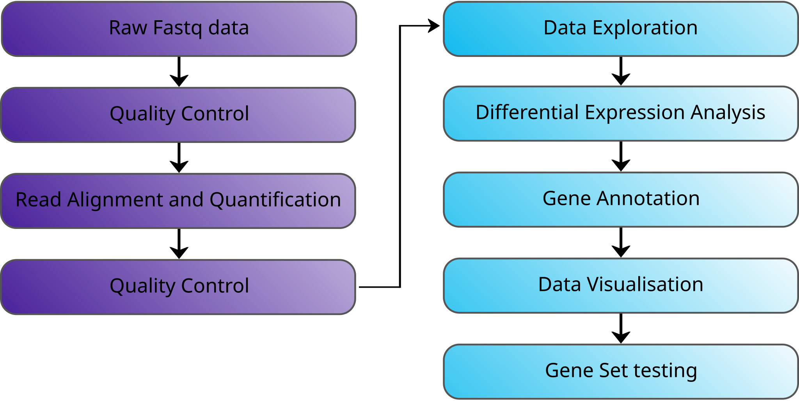
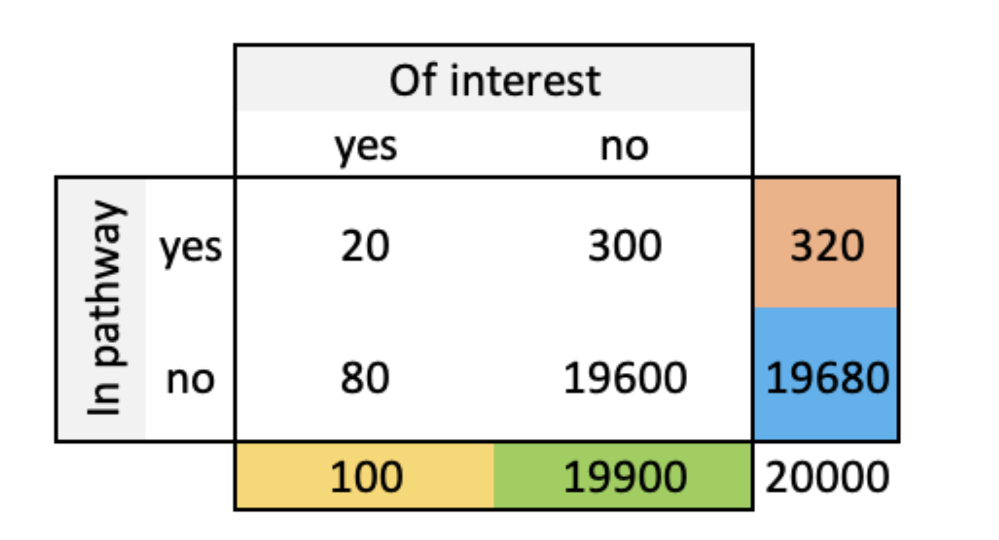

```{r setup, include=FALSE}
library(tidyverse)
library(gganimate)
library(cowplot)
knitr::opts_chunk$set(
  collapse = TRUE,
  comment = "#>",
  gganimate = list(
    nframes = 50
  ),
  out.width = '100%',
  dev.args=list(bg="transparent")
)
theme_set(theme_bw(base_size=12)) 
theme_update(panel.background = element_rect(fill = "transparent", colour = NA), 
             plot.background = element_rect(fill = "transparent", colour = NA)) 
```

## Differential Gene Expression Analysis Workflow {#less_space_after_title}

<div style="line-height: 50%;"><br></div>



## Gene Set Testing - Overview

The list of differentially expressed genes is sometimes:

* so long that its interpretation becomes cumbersome and time consuming,

* or very short while some genes have low p-value yet higher than the given threshold.

There are many approaches to searching for biological meaning in the results
of differential expression analysis.

Commonly we assess whether the differentially expressed genes (as a *set*) tend to relate
to specific pathways or ontological groups of genes. 

We will look at two methods:

* Over Representation Analysis (ORA)

* Gene Set Enrichment Analysis (GSEA)

## Gene Set Testing - Resources

Common sources of gene sets:

* [KEGG pathways](https://www.kegg.jp/)

* [Gene Ontologies](http://geneontology.org/docs/ontology-documentation/)

* [Reactome](https://reactome.org/)

* [Molecular Signature Database, MSigDB (GSEA)](https://www.gsea-msigdb.org/gsea/msigdb/)

* Manually curated gene lists


## Over Representation Analysis - Method

* This method tests whether genes in a specific pathway are present in a subset of 
  genes of interest in our data more than expected.

* The genes of interest could be e.g. statistically significant differentially expressed
  genes or a cluster of genes from hierachical or k-means clustering.
  
* We calculate the overlap between our genes of interest and genes in the pathway and assess
  if the resulting intersection size is due to chance based on the Fisher’s exact test (aka hypergeometric test).


## Over Representation Analysis - Example

Genes in the experiment (the **gene universe** or **background**) are split in two ways:
  
* annotated to the pathway or not
* differentially expressed or not

Contingency table:



Calculate the probability of seeing such contingency table given the gene universe size (=20,000) and the number of genes of interest (=100) and genes in the pathway (=320) with the hypergeometric/Fisher's exact test. 

For details see this [blog post](https://daianna-glez.github.io/daianna_blog/posts/2024-08-11-Fisher_test/).


## Gene Set Enrichment Analysis (GSEA)

* First proposed by Subramanian et al. in 2005 (original publication [here](https://doi.org/10.1073/pnas.0506580102)).

* This method ranks all our genes in the experiment by their association with the studied phenotype/treatment, thus not restricting the analysis to significant genes only (with p-value < $\alpha$).

* The genes in a pathway are located in such ranking, thus identifying their association level with the phenotype/treatment. 

* Based on the ranking and where the pathway genes are within that ranking, an enrichment score and a corresponding p-value are computed to assess whether the pathway is positively or negatively affected in the experiment.


## Gene Set Enrichment Analysis (GSEA) - Method

First rank all genes in our dataset by their decreasing association with the studied phenotype/treatment.   
    
* The ranking metric varies, but p-value and signed log-fold change (or both multiplied) are common choices.   

Example: ranking by decreasing signed log-fold change ($logFC$). 

```{r loadGSEAdata, include=FALSE, message=FALSE, warning=FALSE}
set.seed(1)
tab <- readRDS("RObjects/Shrunk_Results.d11.rds") %>% 
    slice(1:150) %>% 
    select(log2FoldChange) %>% 
    rowid_to_column("Index") %>% 
    arrange(desc(log2FoldChange)) %>% 
    rowid_to_column("Index2") %>% 
    mutate(inGeneSetA = Index2 %in% c(2,3,6,8,
                                      10,11,12,13,
                                      19,21,23,24, 
                                      26,28,35,41,
                                      90,100,110,125)) %>%  
    mutate(ScoreA = ifelse(inGeneSetA, abs(log2FoldChange)/sum(abs(subset(., inGeneSetA == TRUE)$log2FoldChange)), -1/130)) %>% 
    mutate(CumScoreA = cumsum(ScoreA)) %>% 
    mutate(inGeneSetB = Index2 %in% c(77,99,111,117,
                                      133,134,137,139,
                                      141,142,143,145,
                                      146,148,149)) %>%  
    mutate(ScoreB = ifelse(inGeneSetB, abs(log2FoldChange)/sum(abs(subset(., inGeneSetB == TRUE)$log2FoldChange)), -1/135)) %>% 
    mutate(CumScoreB = cumsum(ScoreB)) %>% 
    mutate(inGeneSetC = Index2 %in% 
               sample(1:150, 20, replace = FALSE)) %>%  
    mutate(ScoreC = ifelse(inGeneSetC, 
                          (log2FoldChange)/sum(abs(subset(., inGeneSetC == TRUE)$log2FoldChange)), 
                          -0.00530)) %>% 
    mutate(CumScoreC = cumsum(ScoreC))
```

<div style="width: 80%; margin-left: 10%">
```{r Foldchanges, echo = FALSE, dpi = 300, fig.width= 5, fig.height=2}
p1 = tab %>% 
  ggplot(aes(x = Index, y = log2FoldChange)) +
  geom_segment(aes(xend = Index), yend = 0) + 
  theme(axis.title = element_text(size = 9), 
        axis.text = element_text(size = 8))

p2 = tab %>% 
  ggplot(aes(x = Index2, y = log2FoldChange)) +
  geom_segment(aes(xend = Index2), yend = 0, linewidth = 0.25) +
  labs(x = "Ranking Index") +
      theme(axis.title = element_text(size = 9), 
        axis.text = element_text(size = 8))

plot_grid(p1, p2, align = "h")
```
</div> 


## Gene Set Enrichment Analysis (GSEA) - Method  

Identify the position of genes in the pathway in the ranking:  

* if the pathway genes are up-regulated then they appear at the top (left) of the ranking     
* if they are down-regulated at they are at the bottom (right).   

<div style="width: 80%; margin-left: 10%">
```{r FoldchangesWithGeneSet, echo = FALSE, dpi = 300, fig.width= 4, fig.height=2, warning=FALSE, message=FALSE}
tab %>%  
  ggplot(aes(x = Index2, y = log2FoldChange)) +
  geom_segment(aes(xend = Index2, colour = inGeneSetA), yend = 0) +
  scale_colour_manual(values = c("darkgrey", "red")) +
  guides(colour = FALSE) +
  labs(x = "Ranking Index")
```
</div>


## Gene Set Enrichment Analysis (GSEA) - Method  

GSEA calculates an **E**nrichment **S**core based on the ranking:   

* The ES starts at 0  
* Walk throughout the ranking and for each gene:    
    * Increase the ES by 1 step if the gene is in the pathway.    
    * Decrease the ES by 1 step if not.  

## Gene Set Enrichment Analysis (GSEA) - Method  

GSEA calculates an **E**nrichment **S**core based on the ranking:   

* The ES starts at 0  
* Walk throughout the ranking and for each gene:    
    * Increase the ES by 1 step if the gene is in the pathway.    
    * Decrease the ES by 1 step if not.  

<div style="width: 80%; margin-left: 10%">
```{r anim1, echo=FALSE, message=FALSE, warning=FALSE}
p <- tab %>% 
    ggplot() +
    geom_segment(aes(x = Index2, xend = Index2, colour = inGeneSetA, 
                     group = seq_along(Index2)), 
                  y = -0.25, yend = 0.25) +
    geom_point(x = 0, y = 0, size = 1, colour = "black") +
    geom_line(aes(x = Index2, y = CumScoreA)) +
    scale_y_continuous(limits = c(-1,1)) +
    scale_colour_manual(values = c("darkgrey", "red")) +
    guides(colour = FALSE) +
    labs(x = "Ranking Index", y = "Enrichment Score") +
    theme(axis.title = element_text(size = 7), 
         axis.text = element_text(size = 6)) +
    transition_reveal(Index2) 

animate(p, nframes = 150, fps = 10, renderer = gifski_renderer(loop = FALSE), 
        res = 300, width = 3.5, height = 1.8, units = "in", bg = "transparent")
```
</div>

## Gene Set Enrichment Analysis (GSEA) - Method  

* The step size for a gene in the pathway is proportional to its $logFC$ (or whatever the ranking metric was) as we want to capture not only if the pathway gene is at the top/bottom but also to what extent it is affected. The gene's step size is normalized by the sum of the metric of all genes in the pathway to account for the pathway size and the scale of the metric used for ranking.

* The step size for those genes not in the pathway is the same decrease for all, normalized by the number of such genes outside the pathway.

## Gene Set Enrichment Analysis (GSEA) - Method 

The final enrichment score for the pathway represents the value in the walking sum that deviates the furthest from zero.

<div style="width: 80%; margin-left: 10%">
```{r ES, echo=FALSE, message=FALSE, warning=FALSE, fig.width= 4, fig.height=2}
p <- tab %>% 
    ggplot() +
    geom_segment(aes(x = Index2, xend = Index2, colour = inGeneSetA, 
                     group = seq_along(Index2)), 
                  y = -0.25, yend = 0.25) +
    geom_point(x = 0, y = 0, size = 1, colour = "black") +
    geom_line(aes(x = Index2, y = CumScoreA)) +
    geom_segment(x = which.max(tab$CumScoreA), xend = which.max(tab$CumScoreA),
                  y = 0, yend = max(tab$CumScoreA), color = "blue") +
    scale_y_continuous(limits = c(-1,1)) +
    scale_colour_manual(values = c("darkgrey", "red")) +
    guides(colour = FALSE) +
    labs(x = "Ranking Index", y = "Enrichment Score") +
    theme(axis.title = element_text(size = 9), 
        axis.text = element_text(size = 8)) 
p
```
</div>

## GSEA - Calculate the enrichment score

A different gene set enriched at the bottom of the gene ranking:

<div style="width: 80%; margin-left: 10%">
```{r anim2, echo=FALSE, warning=FALSE, message=FALSE}
p <- tab %>% 
    ggplot(aes(x = Index2)) +
    geom_segment(aes(xend = Index2, colour = inGeneSetB,
                     group = seq_along(Index2)), 
                  y = -0.25, yend = 0.25) +
    geom_line(aes(y = CumScoreB)) +
    geom_point(x = 0, y = 0, size = 1, colour = "black") +
    scale_y_continuous(limits = c(-1,1)) +
    labs(x = "Ranking Index", y = "Enrichment Score") +
    scale_colour_manual(values = c("darkgrey", "red")) +
    guides(colour = FALSE) +
    transition_reveal(Index2)

animate(p, nframes = 150, fps = 15, renderer = gifski_renderer(loop = FALSE), 
        res = 300, width = 4, height = 2.5, units = "in", bg = "transparent")
```
</div>


## GSEA - Calculate the enrichment score

A random gene set: 

<div style="width: 80%; margin-left: 10%">
```{r anim3, echo=FALSE, message=FALSE, warning=FALSE}
p <- tab %>% 
    ggplot() +
    geom_segment(aes(x = Index2, xend = Index2, colour = inGeneSetC, 
                     group = seq_along(Index2)), 
                  y = -0.25, yend = 0.25) +
    geom_point(x = 0, y = 0, size = 1, colour = "black") +
    geom_line(aes(x = Index2, y = CumScoreC)) +
    scale_y_continuous(limits = c(-1,1)) +
    scale_colour_manual(values = c("darkgrey", "red")) +
    guides(colour = FALSE) +
    labs(x = "Ranking Index", y = "Enrichment Score") +
    transition_reveal(Index2)

animate(p, nframes = 150, fps = 10, renderer = gifski_renderer(loop = FALSE), 
        res = 300, width = 4, height = 2.5, units = "in", bg = "transparent")
```
</div>


## Gene Set Enrichment Analysis (GSEA) - Method  

The p-value of the enrichment score is computed by either:

* permuting the sample phenotype/treatment labels to obtain new gene logFCs   
* drawing random gene sets of the same size as the pathway 
    
In each case compute new enrichment scores. Do this many times to generate a "null" distribution, i.e. a distribution of enrichment scores for situations that have no biological meaning.

The p-value is the proportion of such scores that are equal or greater than the observed score.

<div style="width: 50%; margin-left: 30%; padding-top: 10px">
```{r pvalue, echo=FALSE, message=FALSE, warning=FALSE, fig.width= 4.5, fig.height=3}
x1 <- seq(-6, 6, length=100)
hx1 <- dnorm(x1, mean = 0, sd = 1.5)
par(bg = NA, mar = c(5, 4, 0, 4) + 0.1) 

plot(x1, hx1, type = "l", lty = 1, lwd = 2,
     xlab = "Enrichment Score", ylab = "Density",
     col = "tomato", ylim = c(0, 0.3), xlim = c(-7, 7))
abline(v = 4, col = "darkgreen", lty = 2, lwd = 2)
```
</div>


## Recap

Question: Do the differentially expressed genes tend to relate
to specific pathways or ontological groups of genes?

For a given contrast and a given gene set.

Two methods:

* Over Representation Analysis (ORA)

    - split genes: in pathway or not, of interest or not
    - Fisher's exact test for ratio of 'pathway' odds in the two 'interest' classes   

* Gene Set Enrichment Analysis (GSEA)

    - rank all genes using significance and/or log2FoldChange
    - compute enrichment score
    - compute its significance

Both methods are applicable to series of gene sets.
